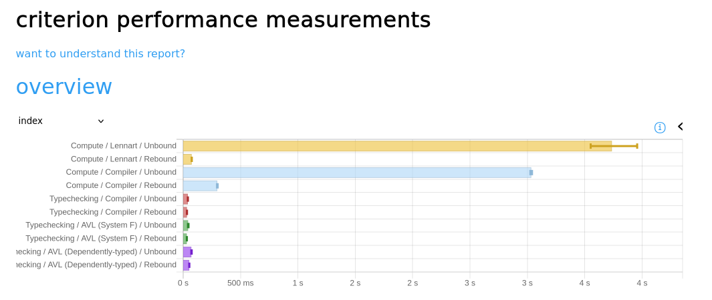

# pi-forall language

An (re-)implementation of [pi-forall](https://github.com/sweirich/pi-forall).

## Typechecking a file

You can typecheck a file (e.g. the `DepAVL` benchmark) using the new
implementation using
```
stack ghci src/PiForall/Rebound/Modules.hs
goFilename ["pi/std", "pi/examples"] "pi/examples/AVL.pi"
```
The first argument is a list of paths to files which may be imported, and the
last argument is the main file to typecheck.

If the whole file is printed back, typechecking succeeded. Otherwise, an error
will be displayed:
```
Type Error:
pi/examples/AVL.pi:160:30: Cannot equate rh and Succ rh
  When checking the term [...]
  against the type
  insert_ : (C : Comparable) -> (n : Nat) -> (_internal : AVL_ C n False) -> (_internal : T C) -> MAVL_ C n True False
  in the expression Fork lh l v (Succ rh) r' RightHeavy
*** Exception: ExitFailure 1
```

To use the old typechecker, just replace `Rebound` with `Unbound`:
```
stack ghci src/PiForall/Unbound/Modules.hs
goFilename ["pi/std", "pi/examples"] "pi/examples/AVL.pi"
```

## Testing

Just run
```
stack test
```
which should result in something like
```
pi-forall> test (suite: test-pi-forall)

/
  Unbound
    PP-Parsing round trip:     OK (0.20s)
      +++ OK, passed 100 tests.
    Standard Library
      Equality [✔]:            OK (0.03s)
      ...
    Examples
      Hurkens [✔]:             OK
      ...
  Rebound
    PP-Parsing round trip:     OK (0.15s)
      +++ OK, passed 100 tests.
    Standard Library
      Equality [✔]:            OK (0.02s)
      ...
    Examples
      Hurkens [✔]:             OK
      ...
    Base tests
      Fail [✘]:                OK
      ConstructorEvidence [✘]: OK
    Bugs
      Bug1 [✔]:                OK
      Bug2 [✔]:                OK

All 36 tests passed (1.52s)
```

**Note:** The symbol after the test name (`✔` or `✘`) indicates whether the test
is positive (a program which should be accepted) or negative (a program which
should be rejected). Whether the test succeeded or not is indicated by the text
on the right (`OK`).

## Benchmarks

Run the following command
```
stack bench --benchmark-arguments="--output=pi.html"
```
to generate a comparison between the two type checkers.
You can then open the generated HTML (`pi.html`) in your browser.



Here is a table matching the benchmarks in the report to the ones in table 3 of
the paper:

Report                                 | Paper
---------------------------------------|---------
`Compute/Lennart`                      | Lennart
`Compute/Compiler`                     | CompCk
`Typechecking/Compiler`                | Compiler
`Typechecking/AVL (System F)`          | AVL
`Typechecking/AVL (Dependently-typed)` | DepAVL

